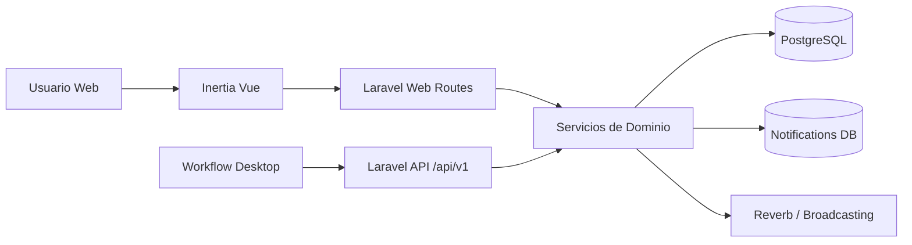
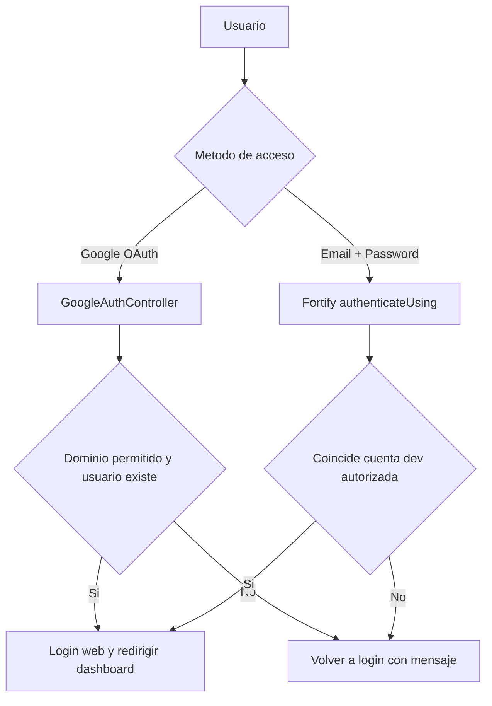
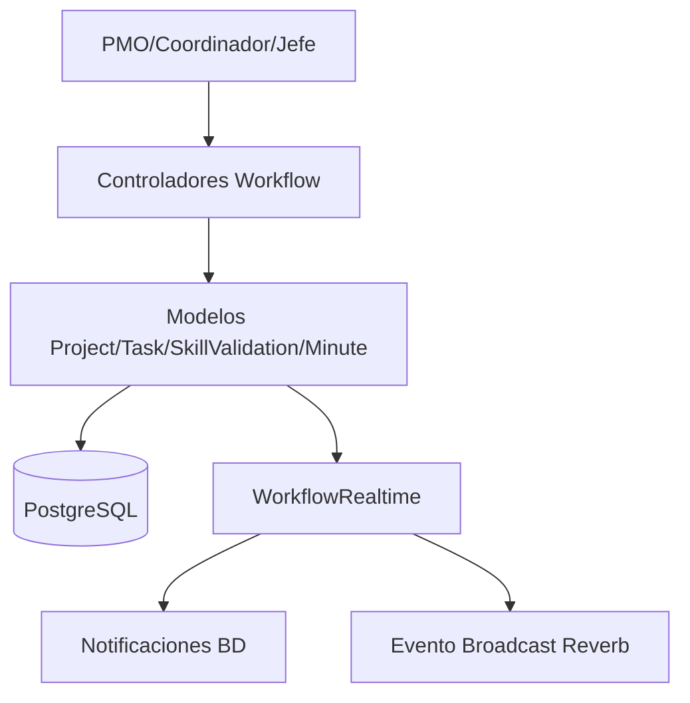
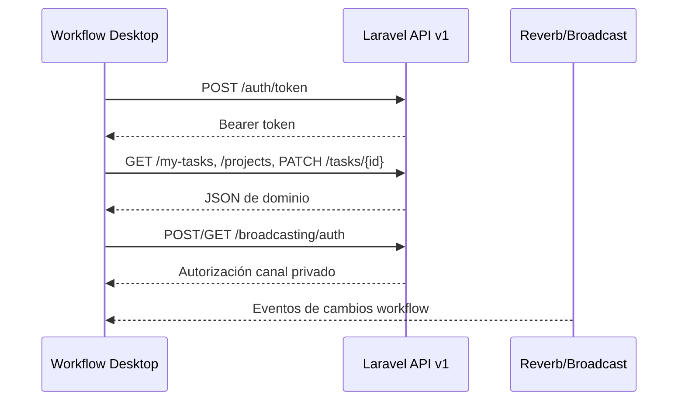

# Workflow (backend y web)

**Versión actual:** `0.3.0` (alineada con `composer.json`).

Workflow es la plataforma CFRD/UdeC para gestión de proyectos, tareas, validaciones y trazabilidad operativa. Este repositorio contiene:

- **Backend Laravel 13** (dominio, seguridad, API, auditoría, notificaciones, realtime).
- **Frontend web Inertia + Vue 3** (vistas por rol: PMO, coordinación, jefatura, colaborador).
- **API REST `/api/v1`** para clientes externos, incluyendo Workflow Desktop.

---

## 1) Objetivo funcional

Centralizar el ciclo operativo de proyectos:

- planificación y cartera (PMO),
- coordinación de carga/backlog y validación,
- ejecución diaria (kanban/minutas),
- seguimiento de talento (skills y validaciones),
- visibilidad del sistema (auditoría, notificaciones, estado LRS).

---

## 2) Stack tecnológico

- **Backend:** PHP 8.3+, Laravel 13, Sanctum, Fortify, Socialite, Spatie Permission, Reverb.
- **Frontend:** Vue 3, Inertia, Tailwind.
- **Datos:** PostgreSQL.
- **Calidad:** Pest, PHPUnit, Laravel Pint.

---

## 3) Módulos implementados

### Web (Inertia) por contexto

- **Dashboard**: resumen personalizado por rol.
- **PMO**: tablero macro, cartera de proyectos, indicadores, gantt/kanban macro.
- **Coordinación**: equipos y carga, backlog, validación de urgentes y skills.
- **Proyecto**: tabla, cronograma, calendario, kanban, minutas.
- **Colaborador**: mis tareas y urgentes.
- **Talento**: matriz de skills y mapa de relaciones.
- **Sistema**: auditoría, notificaciones y estado de integración LRS.

### API (`/api/v1`)

- Token de acceso (`auth/token`) con Sanctum.
- Perfil del usuario autenticado (`user`).
- Consulta de tareas propias (`my-tasks`).
- CRUD base de proyectos y tareas por proyecto.
- Actualización de tareas.
- Autorización de canales broadcasting para realtime (`broadcasting/auth`).

---

## 4) Arquitectura y flujo general



### Separación de responsabilidades

- `routes/web.php`: navegación y pantallas Inertia con sesión web.
- `routes/api.php`: endpoints JSON para token/bearer (desktop e integraciones).
- Lógica de negocio centralizada en backend; clientes consumen contrato API.

---

## 5) Flujos clave

### 5.1 Autenticación



Notas:

- Login web por contraseña está restringido a una cuenta configurada para construcción/desarrollo.
- Google OAuth valida dominios permitidos y mapea al usuario existente.
- Para API/desktop se usa `POST /api/v1/auth/token` + `auth:sanctum`.

### 5.2 Operación de proyectos y tareas



### 5.3 Consumo Desktop/API + realtime



---

## 6) Estructura del repositorio

```text
workflow/
  app/
    Http/Controllers/Workflow/      # Modulos web por rol
    Http/Controllers/Api/V1/        # API JSON
    Models/                         # Dominio (Project, Task, Skill, AuditLog, etc.)
    Services/                       # Notificaciones, monitoreo de completitud
    Support/WorkflowRealtime.php    # Emision de eventos + notificaciones
  routes/
    web.php
    api.php
    settings.php
    channels.php
  resources/js/
    pages/                          # Vistas Inertia por modulo
    layouts/
    components/workflow/
  database/
    migrations/
    seeders/
  tests/Feature/
```

---

## 7) Variables y configuración relevante

- `WORKFLOW_CFRD_DOMAIN`, `WORKFLOW_CFRD_DOMAINS`: dominios permitidos de correo.
- `WORKFLOW_DEV_PASSWORD_EMAIL`: cuenta habilitada para login web por contraseña.
- `WORKFLOW_LRS_ENABLED`, `WORKFLOW_LRS_ENDPOINT`, `WORKFLOW_LRS_KEY`: estado/config LRS.
- Configuración de broadcasting/reverb en `config/broadcasting.php` y `config/reverb.php`.

---

## 8) Arranque local

```bash
cp .env.example .env
composer install
npm install
php artisan key:generate
php artisan migrate
php artisan serve
```

En otra terminal:

```bash
npm run dev
```

### Scripts útiles

- `composer dev`: servidor + cola + logs + Vite en paralelo.
- `composer test`: lint check + tests de Laravel.
- `composer lint` / `composer lint:check`: estilo PHP con Pint.

---

## 9) Seguridad y autorización

- Middleware de roles con Spatie (`role:*`) aplicado por ruta.
- Guard `auth` + `verified` para superficies web protegidas.
- `auth:sanctum` para API.
- Canal privado de broadcasting autorizado por usuario autenticado.

---

## 10) Estado de integraciones

- **Realtime (Reverb/Broadcast):** implementado y operativo en flujo de cambios.
- **Notificaciones internas (BD):** implementadas.
- **LRS/xAPI:** base de configuración y vista de estado; integración funcional completa pendiente.
- **Webhooks GitLab de negocio:** no implementados en este repo actualmente.

---

## 11) Calidad y pruebas existentes

Cobertura feature en áreas clave:

- autenticación (Fortify, Google, 2FA, reset),
- settings de cuenta y seguridad,
- rutas y middleware por rol,
- API de workflow,
- sincronización kanban y notificaciones de actividad.

Ejecutar:

```bash
php artisan test
```

---

## 12) Versionado y documentación relacionada

- Política de versionado: [`../doc/project/VERSIONING.md`](../doc/project/VERSIONING.md)
- Historial de cambios: [`../doc/project/CHANGELOG.md`](../doc/project/CHANGELOG.md)
- Fuente de versión del paquete backend: `composer.json`

Al publicar cambios de producto, mantener sincronizados `CHANGELOG`, `versions.json`, `composer.json` y este README.
