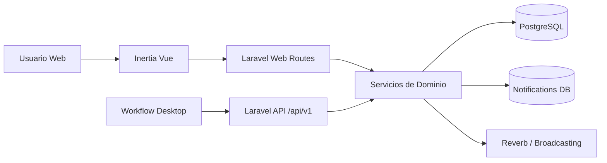
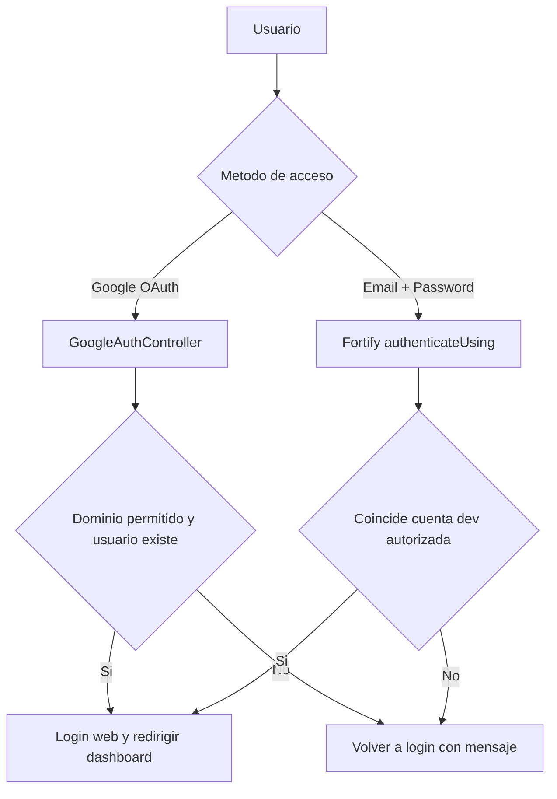
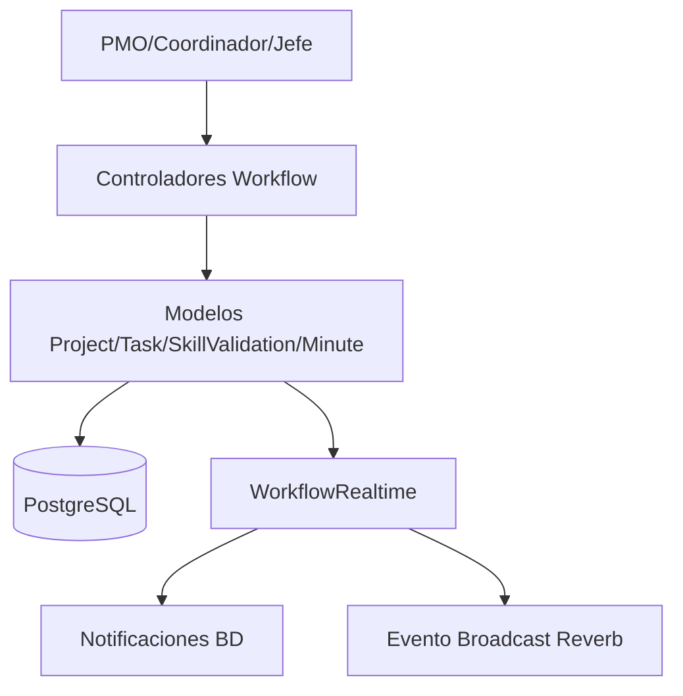
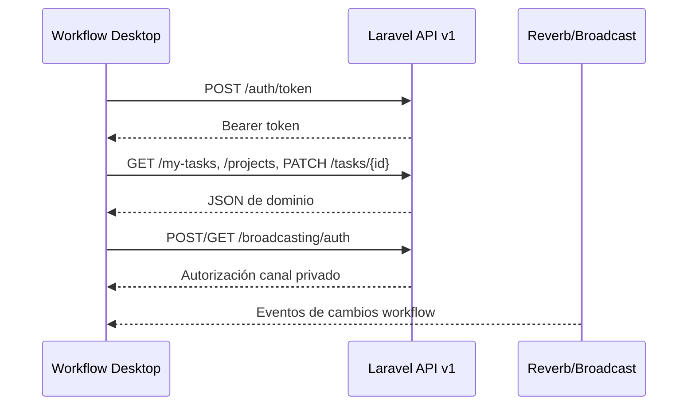

# Workflow (backend y web)

**Versión actual:** `0.4.5` (alineada con `package.json` y `composer.json`).

Workflow es la plataforma CFRD/UdeC para gestión de proyectos, tareas, validaciones y trazabilidad operativa. Este repositorio contiene:

- **Backend Laravel 13** (dominio, seguridad, API, auditoría, notificaciones, realtime).
- **Frontend web Inertia + Vue 3** (vistas por rol: PMO, coordinación, jefatura, colaborador).
- **API REST `/api/v1`** para clientes externos, incluyendo Workflow Desktop.

---

## 1) Objetivo funcional

Centralizar el ciclo operativo de proyectos:

- planificación y cartera (PMO),
- coordinación de carga/backlog y validación,
- ejecución diaria (kanban/minutas),
- seguimiento de talento (skills y validaciones),
- visibilidad del sistema (auditoría, notificaciones, estado LRS).

---

## 2) Stack tecnológico

- **Backend:** PHP 8.4+, Laravel 13, Sanctum, Fortify, Socialite, Spatie Permission, Reverb.
- **Frontend:** Vue 3, Inertia, Tailwind.
- **Datos:** PostgreSQL.
- **Calidad:** Pest, PHPUnit, Laravel Pint.

---

## 3) Módulos implementados

### Web (Inertia) por contexto

- **Dashboard**: resumen personalizado por rol con tarjetas accionables y buzón de actividad.
- **PMO**: tablero macro, cartera de proyectos, indicadores, gantt/kanban macro, mapa de calor con alertas diarias/paralelas y resumen compacto.
- **Coordinación**: equipos y carga (con filtros, modales de gestión y acciones), backlog, validación de urgentes y skills.
- **Proyecto**: tabla, cronograma, calendario, kanban y minutas.
- **Colaborador**: mis tareas y urgentes.
- **Talento**: matriz de skills y mapa de relaciones.
- **Sistema**: auditoría, notificaciones, configuración transversal, usuarios/roles, áreas y estado de integración LRS.

### Capacidades recientes destacadas

- **Gestión de Áreas (CRUD)**: creación/edición/eliminación de áreas, asignación de personas, coordinador a cargo por área y sincronización automática del coordinador como miembro.
- **Kanban configurable**:
  - estados transversales por defecto,
  - estados por proyecto (crear/editar/eliminar),
  - reordenamiento visual de columnas por drag & drop (proyecto y transversal),
  - fallback automático a configuración transversal si el proyecto no define estados.
- **Tablero macro**:
  - formatos de fecha en estándar `dd-mm-yyyy`,
  - mejoras de modal de proyecto (ancho ampliado + alto máximo controlado),
  - ajustes de lista de tareas, Gantt interactivo y accesos rápidos.
- **Mapa de carga**:
  - alertas por sobrecarga diaria,
  - alertas por proyectos en paralelo,
  - umbrales configurables en configuración transversal.
- **Versionado automático**:
  - cada `npm run build` incrementa versión semántica,
  - sincroniza `package.json` + `composer.json`,
  - publica versión visible en el header de la app.

### API (`/api/v1`)

- Token de acceso (`auth/token`) con Sanctum.
- Perfil del usuario autenticado (`user`).
- Consulta de tareas propias (`my-tasks`).
- CRUD base de proyectos y tareas por proyecto.
- Actualización de tareas.
- Autorización de canales broadcasting para realtime (`broadcasting/auth`).

---

## 4) Arquitectura y flujo general



### Separación de responsabilidades

- `routes/web.php`: navegación y pantallas Inertia con sesión web.
- `routes/api.php`: endpoints JSON para token/bearer (desktop e integraciones).
- Lógica de negocio centralizada en backend; clientes consumen contrato API.

---

## 5) Flujos clave

### 5.1 Autenticación



Notas:

- Login web por contraseña está restringido a una cuenta configurada para construcción/desarrollo.
- Google OAuth valida dominios permitidos y mapea al usuario existente.
- Para API/desktop se usa `POST /api/v1/auth/token` + `auth:sanctum`.

### 5.2 Operación de proyectos y tareas



### 5.3 Consumo Desktop/API + realtime



---

## 6) Estructura del repositorio

```text
workflow/
  app/
    Http/Controllers/Workflow/      # Modulos web por rol
    Http/Controllers/Api/V1/        # API JSON
    Models/                         # Dominio (Project, Task, Skill, AuditLog, etc.)
    Services/                       # Notificaciones, monitoreo de completitud
    Support/WorkflowRealtime.php    # Emision de eventos + notificaciones
  routes/
    web.php
    api.php
    settings.php
    channels.php
  resources/js/
    pages/                          # Vistas Inertia por modulo
    layouts/
    components/workflow/
  database/
    migrations/
    seeders/
  tests/Feature/
```

---

## 7) Variables y configuración relevante

- `WORKFLOW_CFRD_DOMAIN`, `WORKFLOW_CFRD_DOMAINS`: dominios permitidos de correo.
- `WORKFLOW_DEV_PASSWORD_EMAIL`: cuenta habilitada para login web por contraseña.
- `WORKFLOW_LRS_ENABLED`, `WORKFLOW_LRS_ENDPOINT`, `WORKFLOW_LRS_KEY`: estado/config LRS.
- Umbrales transversales de carga (incluyendo paralelismo): persistidos desde **Sistema > Configuración transversal**.
- Configuración de broadcasting/reverb en `config/broadcasting.php` y `config/reverb.php`.

---

## 8) Arranque local

```bash
cp .env.example .env
composer install
npm install
php artisan key:generate
php artisan migrate
php artisan serve
```

En otra terminal:

```bash
npm run dev
```

### Arranque con stack CFRD (Traefik + Postgres + Redis)

```bash
cp .env.example .env
docker compose -f deploy/cfrd-stack/docker-compose.yml --env-file .env up -d --build
```

Arranque completo (incluye worker de colas y Reverb):

```bash
docker compose -f deploy/cfrd-stack/docker-compose.yml --env-file .env --profile queue up -d
```

Validaciones recomendadas:

```bash
docker ps --filter name=cfrd-flowcfrd --format "table {{.Names}}\t{{.Status}}"
docker logs --tail 50 cfrd-flowcfrd-backend
docker logs --tail 50 cfrd-flowcfrd-reverb
```

Servicios esperados:

- `cfrd-flowcfrd-backend`: app Laravel (Apache/PHP).
- `cfrd-flowcfrd-queue`: worker para colas Redis.
- `cfrd-flowcfrd-reverb`: servidor WebSocket para realtime.

### Inicialización de base de datos (obligatorio primera vez)

```bash
docker exec cfrd-flowcfrd-backend php artisan key:generate --force
docker exec cfrd-flowcfrd-backend php artisan migrate --force
docker exec cfrd-flowcfrd-backend php artisan db:seed --force
```

### Acceso de desarrollo

- Usuario login por contraseña: `admin@cfrd.cl`
- Contraseña seed dev: `cf753rd/`

Nota:

- Fortify permite login por contraseña solo a la cuenta configurada en `WORKFLOW_DEV_PASSWORD_EMAIL`.
- Si cambia esa variable, recuerda ejecutar seed o ajustar usuario en BD.

### Variables clave para Reverb en Docker

Backend/Queue (interno entre contenedores):

- `REVERB_HOST=flowcfrd-reverb`
- `REVERB_PORT=8080`
- `REVERB_SCHEME=http`

Frontend (navegador por Traefik/TLS):

- `VITE_REVERB_ENABLED=true`
- `VITE_REVERB_HOST=flowcfrdlocal.cfrd.cl`
- `VITE_REVERB_PORT=443`
- `VITE_REVERB_SCHEME=https`

### Scripts útiles

- `composer dev`: servidor + cola + logs + Vite en paralelo.
- `composer test`: lint check + tests de Laravel.
- `composer lint` / `composer lint:check`: estilo PHP con Pint.
- `npm run build`: ejecuta versionado automático + build de assets.
- `npm run build:ssr`: build web + SSR.

---

## 9) Seguridad y autorización

- Middleware de roles con Spatie (`role:*`) aplicado por ruta.
- Guard `auth` + `verified` para superficies web protegidas.
- `auth:sanctum` para API.
- Canal privado de broadcasting autorizado por usuario autenticado.

---

## 10) Estado de integraciones

- **Realtime (Reverb/Broadcast):** implementado y operativo en flujo de cambios.
- **Notificaciones internas (BD):** implementadas.
- **LRS/xAPI:** base de configuración y vista de estado; integración funcional completa pendiente.
- **Webhooks GitLab de negocio:** no implementados en este repo actualmente.

---

## 11) Calidad y pruebas existentes

Cobertura feature en áreas clave:

- autenticación (Fortify, Google, 2FA, reset),
- settings de cuenta y seguridad,
- rutas y middleware por rol,
- API de workflow,
- sincronización kanban y notificaciones de actividad.

Ejecutar:

```bash
php artisan test
```

---

## 12) Versionado automático (build-driven)

El proyecto usa versionado semántico incremental automático en cada compilación:

- Script: `scripts/auto-version.mjs`.
- Se ejecuta dentro de `npm run build`.
- Actualiza de forma sincronizada:
  - `package.json`
  - `composer.json`
  - `.build-version.json` (estado interno del último build).

### Regla de incremento automático

- **`minor`** cuando detecta commits nuevos con prefijo `feat:`.
- **`patch`** en los demás casos.

### Visualización

- La versión activa se expone vía Inertia (`appVersion`) y se muestra en el header principal (`AppSidebarHeader`), esquina superior derecha.

---

## 13) Troubleshooting rapido

### `auth.failed` al intentar login

Causa comun:

- Usuario no existe aun en la BD o no coincide con `WORKFLOW_DEV_PASSWORD_EMAIL`.

Solucion:

```bash
docker exec cfrd-flowcfrd-backend php artisan db:seed --force
```

### Pantalla en blanco + errores Mixed Content

Causa comun:

- App servida en `https` pero assets generados en `http`.

Verificar:

- `APP_URL=https://flowcfrdlocal.cfrd.cl`
- confianza de proxy activa en `bootstrap/app.php` (`trustProxies`).

Luego limpiar cache:

```bash
docker exec cfrd-flowcfrd-backend php artisan optimize:clear
```

### Error WebSocket a `wss://localhost:8080`

Causa comun:

- Variables Vite/Reverb para navegador apuntando a `localhost`.

Solucion:

- Usar valores `VITE_REVERB_*` del bloque anterior (host publico Traefik).
- Recompilar assets si cambiaste `.env`:

```bash
npm run build
```

### El dashboard muestra métricas o accesos no esperados por rol

Causa común:

- Datos de alcance por rol desalineados con membresía de proyecto/área.

Estado actual:

- Coordinación: métricas y listas filtran por su universo de áreas/equipo.
- Colaborador: contempla tareas como responsable y como colaborador adicional.
- Jefatura: accesos del dashboard apuntan a rutas compatibles con sus permisos.
